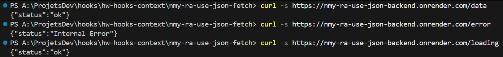

## Учебный проект: Пользовательский хук 'useJsonFetch' для HTTP-запросов

### Тема: Хуки в React

## Публикация

[](https://github.com/NMYurchenko-max/nmy-ra-use-json-fetch/actions/workflows/web.yml)

[Деплой](https://nmyurchenko-max.github.io/nmy-ra-use-json-fetch/)


Сервер данного приложения:
REST‑сервер (Express) опубликован на Render:
- Service ID: srv-d34hqvbipnbc73808v20
- Публичный URL (prod): https://nmy-ra-use-json-backend.onrender.com

## [Описание задачи](https://github.com/netology-code/ra16-homeworks/blob/ra-51/hooks-context/use-json-fetch/README.md)


Использование хука :

`const [data, loading, error] = useJsonFetch(url, opts);`

Логика:

1.  GET http://localhost:7070/data — успешное получение данных;
    - data — данные в формате JSON;
    - loading — true, если данные еще не получены;
    - error — null, если данные получены успешно;

## Структура

Проект состоит из следующих основных компонентов:

- `useJsonFetch<T>(url, options?)`: Пользовательский хук для выполнения HTTP-запросов с автоматическим управлением состояниями загрузки и ошибок.
  - Поддерживает типизацию данных ответа через generic T.
  - Использует переменную окружения `VITE_API_BASE_URL` для формирования полного URL в продакшене (например, для render-сервера).
  - В режиме разработки (dev) переменная не установлена, и используется прокси Vite для перенаправления запросов на локальный сервер.
  - Возвращает массив: `[data, loading, error]`.

- `DataComponent`: Компонент для демонстрации успешного получения данных.
- `ErrorComponent`: Компонент для демонстрации обработки ошибок.
- `LoadingComponent`: Компонент для демонстрации состояния загрузки.

## Реализация хука useJsonFetch

Хук `useJsonFetch` реализован с использованием `useState` и `useEffect` для управления состоянием.

### Особенности реализации:

1. **Типизация**: Использует generic T для типизации данных ответа, по умолчанию `unknown`.
2. **Обработка ошибок**: В catch-блоке проверяется, является ли ошибка экземпляром `Error`, иначе создается новая ошибка.
3. **Отмена запросов**: Использует флаг `isCancelled` для предотвращения установки состояния после размонтирования компонента.
4. **Поддержка продакшена**: Добавлена поддержка переменной окружения `VITE_API_BASE_URL` для работы с render-сервером при публикации на GitHub Actions.

### Использование в продакшене:

- В `.env.production` установлена `VITE_API_BASE_URL=https://nmy-ra-use-json-backend.onrender.com`
- В коде хука `useJsonFetch` добавлено использование переменной окружения:
  ```ts
  const baseUrl = import.meta.env.VITE_API_BASE_URL || '';
  const fullUrl = baseUrl + url;
  const response = await fetch(fullUrl, options);
  ```
- В dev-режиме `baseUrl` пустая строка, и запросы перенаправляются через прокси Vite на `http://localhost:7070`.

## Тестирование render-сервера  

Проверка эндпоинтов на render-сервере:

- `curl -s https://nmy-ra-use-json-backend.onrender.com/data` → `{"status":"ok"}`
- `curl -s https://nmy-ra-use-json-backend.onrender.com/error` → `{"status":"Internal Error"}`
- `curl -s https://nmy-ra-use-json-backend.onrender.com/loading` → `{"status":"ok"}`



## Использование проекта

Клонируйте репозиторий

```bash
git clone https://github.com/NMYurchenko-max/nmy-ra-use-json-fetch.git
```

Установите зависимости

```bash
npm install
```

Запустите сервер разработки

```bash
npm run dev
```

Соберите для продакшена

```bash
npm run build
```

## Авторы

N.Yurchenko
copyright (c) 2025 N.Yurchenko
[ISC License](LICENSE)

[NMYurchenko-max](https://github.com/NMYurchenko-max)
